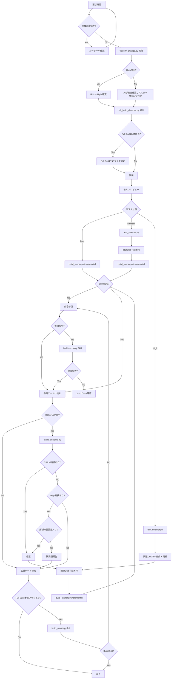

# 実装ワークフロー



# 変更リスク分類ルール

実装開始前に "classify_change.py" を実行し、変更内容を分析する。

このスクリプトは Phase1 / Phase2 の一次判定を行う。

- Phase1: パス、ディレクトリ、ファイル種別による判定
- Phase2: 公開ヘッダ、公開API、共通IF、ビルド設定などの軽量な構造判定

"high_detected=true" が返った場合は High を確定する。

"high_detected=false" の場合のみ、AI が差分を確認して Low / Medium を判定する。

複数の分類に該当する場合は最も高い分類を採用する。

## High

以下のいずれかに該当する場合。

### アーキテクチャ変更

- 公開API変更
- 共通IF変更
- IPC変更
- 要求データ構造変更
- メッセージID変更
- イベントID変更
- 状態遷移変更

### 共通基盤変更

- 共通ライブラリ変更
- 共通モジュール変更
- Driver層変更
- HAL変更
- OS抽象化層変更

### 並列処理・リアルタイム制御

- タスク変更
- スレッド変更
- Mutex変更
- Semaphore変更
- Queue変更
- Event Flag変更
- タイマー制御変更

### 割込み・DMA

- ISR変更
- 割込みハンドラ変更
- DMA処理変更
- DMA通知処理変更

### 通信

- UART通信仕様変更
- SPI通信仕様変更
- I2C通信仕様変更
- CAN通信仕様変更
- Ethernet通信仕様変更
- USB通信仕様変更
- TCP/IP通信仕様変更

### ハードウェア制御

- レジスタアクセス変更
- GPIO制御変更
- モータ制御変更
- センサ制御変更
- 電源制御変更

### 安全性・信頼性

- エラー処理変更
- フェイルセーフ変更
- Watchdog変更
- リカバリ処理変更

## Medium

Highに該当せず、以下に該当する場合。

### 機能変更

- 新規機能追加
- 既存機能拡張
- 業務ロジック変更

### 制御ロジック

- 判定条件変更
- 分岐追加
- 計算式変更

### データ変更

- 設定値追加
- パラメータ追加
- テーブル追加

### 状態管理

- 状態保持変数追加
- 状態監視処理追加

### モジュール内部変更

- 非公開関数追加
- 非公開関数変更
- 内部バッファ処理変更
- 内部メモリ処理変更

## Low

動作変更を伴わない、または極めて限定的な変更。

### ドキュメント

- コメント修正
- README修正
- 設計書修正

### 可読性改善

- リネーム
- フォーマット修正
- 不要コード削除

### ログ

- ログ追加
- ログ文言変更

### UI・表示

- メッセージ文言変更
- 表示名称変更

### リファクタリング

以下を全て満たす場合のみ。

- 振る舞い変更なし
- 公開IF変更なし
- 状態遷移変更なし
- データ構造変更なし

# 品質ゲート

品質ゲートの実施内容は、分類結果とスクリプト出力に従う。

AIはコマンドや対象選定を手作業で保持しない。

実行系は "build_runner.py"、対象選定は "test_selector.py"、静的解析は "static_analysis.py" に寄せる。

## Low

### 実施内容

- セルフレビュー
- "build_runner.py" による Incremental Build

### 推奨

- 既存Unit Testが存在する場合は実行

## Medium

### 実施内容

- セルフレビュー
- "build_runner.py" による Incremental Build
- "test_selector.py" が返した関連Unit Testの実行
- clang-tidy

## High

### 実施内容

- "test_selector.py" による関連Unit Test候補抽出
- 関連Unit Test作成・更新
- 関連Unit Test実行
- セルフレビュー
- "build_runner.py" による Incremental Build
- "static_analysis.py" による clang-tidy
- "static_analysis.py" による cppcheck
- "static_analysis.py" による lizard

### 追加確認項目

- 競合状態
- メモリ破壊
- リソースリーク
- 状態遷移整合性
- イベント整合性
- メッセージ整合性
- 回帰影響

# 自動化スクリプト

## classify_change.py

変更内容を分析し、リスク分類の一次判定を行う。

### 判定方針

- Phase1: パス、ディレクトリ、ファイル種別による判定
- Phase2: 公開ヘッダ、公開API、共通IF、ビルド設定などの軽量な構造判定

### 出力例

```json
{
  "high_detected": true,
  "full_build_required": true,
  "reasons": [
    "public_api_changed",
    "common_module_changed"
  ]
}
```

### 要件

- "high_detected=true" の場合は High を確定する
- "high_detected=false" の場合のみ AI が差分を確認して Low / Medium を判定する
- AI は分類ルール本文を毎回再読しない

## full_build_detector.py

Full Build の要否を判定する。

### 出力例

```json
{
  "full_build_required": true
}
```

### 判定対象

- 共通モジュール変更
- 共通ライブラリ変更
- 公開API変更
- 共通IF変更
- メッセージID変更
- イベントID変更
- 要求データ構造変更
- IPC変更
- ビルド設定変更
- 複数モジュール変更

## build_runner.py

Incremental Build と Full Build を統一実行する。

### サポートするモード

- incremental
- full

### 出力例

```json
{
  "success": true,
  "errors": []
}
```

## test_selector.py

変更内容から関連Unit Testを抽出する。

### 出力例

```json
{
  "tests": [
    "test_print",
    "test_job_manager"
  ]
}
```

## static_analysis.py

静的解析を実行し、結果を集約する。

### 実行対象

- clang-tidy
- cppcheck
- lizard

### 出力例

```json
{
  "critical": [],
  "high": [],
  "medium": [],
  "low": []
}
```

# トークン節約ルール

- 既読ファイルを再読しない
- 必要時は差分のみ取得する
- 影響範囲外ファイルを読まない
- 品質ゲートはリスク分類結果に従う
- High以外では重い解析を実施しない
- Medium / Low指摘は修正ループ対象外
- build-recovery Skillは自己修復失敗後のみ呼び出す
- Full Buildは条件該当時のみ実施する
- 回帰テストは影響範囲内に限定する
- AIは分類・選定・実行の定型処理をスクリプトへ委譲する
- AIは生ログを保持せず、スクリプト出力の要約のみを扱う
- "high_detected=false" のときだけ AI が差分確認を行う

# スクリプト運用方針

- "allowed-tools" に bash を指定する
- 実行ラッパーは bash 前提で呼べるようにする
- 実装は環境依存を抑えた Python スクリプトを基本とする
- 入力は JSON または YAML に統一する
- 出力は JSON に統一する

# その他メモ

- リスク分類ルールや Full Build 条件は Python 側の設定ファイルへ切り出してよい
- 変更しやすさを優先し、細かな判定文言を Skill 本文へ埋め込みすぎない
- AIは「何を実施するか」の最終判断だけを持ち、個別判定ロジックはスクリプトへ寄せる
- Phase1 / Phase2 で High を検出したものは、そのまま High とする
- Phase1 / Phase2 で High が出ないもののみ、AI が差分を見て Low / Medium を判断する