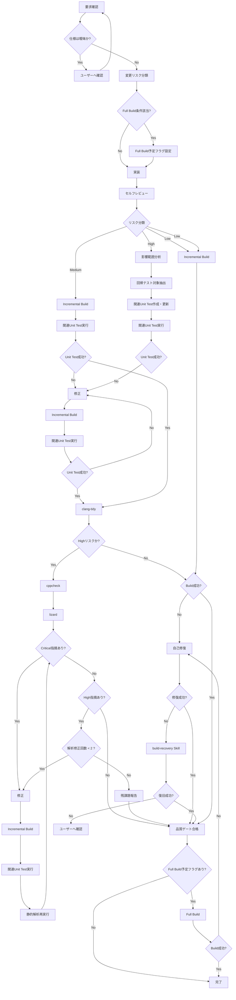

# 実装ワークフロー

---

# 変更リスク分類ルール

実装開始前に変更内容を分析し、Low / Medium / High のいずれかに分類する。

複数の分類に該当する場合は、最も高い分類を採用する。

---

# High

以下のいずれかに該当する場合。

## アーキテクチャ変更

* 公開API変更
* 共通IF変更
* IPC変更
* 要求データ構造変更
* メッセージID変更
* イベントID変更
* 状態遷移変更

## 共通基盤変更

* 共通ライブラリ変更
* 共通モジュール変更
* Driver層変更
* HAL変更
* OS抽象化層変更

## 並列処理・リアルタイム制御

* タスク変更
* スレッド変更
* Mutex変更
* Semaphore変更
* Queue変更
* Event Flag変更
* タイマー制御変更

## 割込み・DMA

* ISR変更
* 割込みハンドラ変更
* DMA処理変更
* DMA通知処理変更

## 通信

* UART通信仕様変更
* SPI通信仕様変更
* I2C通信仕様変更
* CAN通信仕様変更
* Ethernet通信仕様変更
* USB通信仕様変更
* TCP/IP通信仕様変更

## ハードウェア制御

* レジスタアクセス変更
* GPIO制御変更
* モータ制御変更
* センサ制御変更
* 電源制御変更

## 安全性・信頼性

* エラー処理変更
* フェイルセーフ変更
* Watchdog変更
* リカバリ処理変更

---

# Medium

Highに該当せず、以下に該当する場合。

## 機能変更

* 新規機能追加
* 既存機能拡張
* 業務ロジック変更

## 制御ロジック

* 判定条件変更
* 分岐追加
* 計算式変更

## データ変更

* 設定値追加
* パラメータ追加
* テーブル追加

## 状態管理

* 状態保持変数追加
* 状態監視処理追加

## モジュール内部変更

* 非公開関数追加
* 非公開関数変更
* 内部バッファ処理変更
* 内部メモリ処理変更

---

# Low

動作変更を伴わない、または極めて限定的な変更。

## ドキュメント

* コメント修正
* README修正
* 設計書修正

## 可読性改善

* リネーム
* フォーマット修正
* 不要コード削除

## ログ

* ログ追加
* ログ文言変更

## UI・表示

* メッセージ文言変更
* 表示名称変更

## リファクタリング

以下を全て満たす場合のみ。

* 振る舞い変更なし
* 公開IF変更なし
* 状態遷移変更なし
* データ構造変更なし

---

# 品質ゲート

## Low

実施内容

* セルフレビュー
* Incremental Build

推奨

* 既存Unit Testが存在する場合は実行

---

## Medium

実施内容

* セルフレビュー
* Incremental Build
* 関連Unit Test実行
* clang-tidy

---

## High

実施内容

* 影響範囲分析
* 回帰テスト対象抽出
* セルフレビュー
* Incremental Build
* 関連Unit Test作成・更新
* 関連Unit Test実行
* clang-tidy
* cppcheck
* lizard

追加確認項目

* 競合状態
* メモリ破壊
* リソースリーク
* 状態遷移整合性
* イベント整合性
* メッセージ整合性
* 回帰影響

---

# Unit Testルール

## Medium

既存テストが存在する場合は必ず実行する。

存在しない場合は作成不要。

---

## High

以下を実施する。

* 関連Unit Test作成または更新
* 関連Unit Test実行
* 回帰テスト実行

---

## テスト失敗時

以下を繰り返す。

* 修正
* Incremental Build
* Unit Test実行

成功するまで継続する。

---

# 静的解析ルール

解析結果を以下の重要度で分類する。

## Critical

必ず修正する。

例

* NULL参照
* バッファオーバーラン
* Use After Free
* デッドロック
* 未初期化変数

---

## High

原則修正する。

例

* メモリリーク
* 危険なキャスト
* 競合状態

---

## Medium

修正推奨。

例

* 複雑度超過
* 可読性問題

---

## Low

修正不要。

例

* 命名規則
* フォーマット

---

# 解析修正ループ

## Critical

完了禁止。

必ず修正する。

---

## High

修正後に以下を再実施する。

* Incremental Build
* 関連Unit Test
* 静的解析

最大2回まで繰り返す。

残存する場合は課題として報告する。

---

## Medium / Low

報告のみ。

修正ループ対象外。

---

# Build失敗時

## 1回目

* 自己修復

## 2回目

* build-recovery Skill

## 3回目

* 作業停止
* ユーザーへ確認依頼

---

# Full Build実施条件

以下のいずれかに該当する場合。

* 共通モジュール変更
* 共通ライブラリ変更
* 公開API変更
* 共通IF変更
* メッセージID変更
* イベントID変更
* 要求データ構造変更
* IPC変更
* ビルド設定変更
* 複数モジュール変更

---

# 回帰テスト対象抽出ルール

High変更時は以下を確認する。

* 呼び出し元モジュール
* 呼び出し先モジュール
* 共通モジュール利用箇所
* 関連状態遷移
* 関連イベント
* 関連メッセージ

影響範囲に含まれる既存テストを回帰対象とする。

---

# トークン節約ルール

* 既読ファイルを再読しない
* 必要時は差分のみ取得する
* 影響範囲外ファイルを読まない
* 品質ゲートはリスク分類結果に従う
* High以外では重い解析を実施しない
* Medium / Low指摘は修正ループ対象外
* build-recovery Skillは自己修復失敗後のみ呼び出す
* Full Buildは条件該当時のみ実施する
* 回帰テストは影響範囲内に限定する

---

# その他メモ

* allowed-toolsにbashを指定する。スクリプトやパスもbash前提で。ただ、基本的にはどの環境でも使えるPythonスクリプトを使いたい。